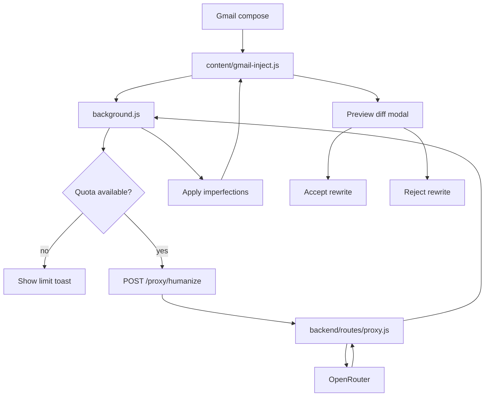

# Fumbl Chrome Extension

Fumbl is a Chrome extension that humanizes AI-written emails inside Gmail. It injects a small toolbar into Gmail compose windows, lets the user choose a rewrite style, previews the rewrite, and keeps a local undo snapshot.

The extension now uses a backend proxy powered by OpenRouter. The OpenRouter API key stays in `backend/.env` and is never stored in Chrome.

## Features

- Gmail compose toolbar with three modes:
  - **Subtle**: light professional polish
  - **Human**: warmer, more natural wording
  - **CEO**: short, direct, lowercase style
- Preview modal with sentence-level diff before applying changes
- Undo last rewrite from local storage
- Daily free rewrite quota support
- Stripe checkout/pro verification stubs
- OpenRouter backend proxy
- Tone Guard for sensitive email categories
- No telemetry and no email text logging

## Project structure

```text
fumbl-extension/
├── manifest.json              # Chrome MV3 extension manifest
├── background.js              # Extension service worker, quota + backend proxy calls
├── prompts.js                 # Rewrite prompt builder used by tests
├── imperfections.js           # Post-processing typo/imperfection library
├── content/
│   ├── gmail-inject.js        # Gmail toolbar injection and rewrite flow
│   ├── preview-modal.js       # Reserved/empty content script file
│   └── toolbar.css            # Gmail toolbar, toast, preview modal styles
├── popup/
│   ├── popup.html             # Extension popup UI
│   ├── popup.css              # Popup styling
│   └── popup.js               # Popup state and interactions
├── backend/
│   ├── server.js              # Express app
│   ├── .env                   # Local secrets, put OpenRouter key here
│   ├── .env.example           # Environment template
│   ├── routes/
│   │   ├── proxy.js           # OpenRouter rewrite proxy
│   │   ├── checkout.js        # Stripe checkout session route
│   │   ├── webhook.js         # Stripe webhook route
│   │   └── verify-pro.js      # Pro status route
│   └── db/users.js            # In-memory dev user store
└── tests/
    ├── test-prompts.js
    └── test-imperfections.js
```

## Additional documentation

- [`backend/README.md`](backend/README.md): backend API, environment variables, OpenRouter, Stripe, and production checklist.
- [`docs/EXTENSION.md`](docs/EXTENSION.md): Chrome extension architecture, message flow, storage keys, and Gmail injection notes.
- [`docs/DEVELOPER.md`](docs/DEVELOPER.md): developer workflow, smoke tests, manual QA, packaging, and release checklist.

## Requirements

- Node.js 18+ recommended
- Google Chrome or Chromium-based browser
- OpenRouter API key

## Setup

### 1. Install root dependencies

The root package currently only uses Node built-ins for tests, but run this if dependencies are added later:

```bash
npm install
```

### 2. Install backend dependencies

```bash
cd backend
npm install
```

### 3. Configure backend environment

Open `backend/.env` and paste your OpenRouter key:

```env
OPENROUTER_API_KEY=sk-or-your-key-here
OPENROUTER_MODEL=anthropic/claude-3.5-sonnet
OPENROUTER_CLASSIFIER_MODEL=anthropic/claude-3-haiku
OPENROUTER_SITE_URL=http://localhost:3000
OPENROUTER_APP_NAME=Fumbl
PORT=3000
```

You can change `OPENROUTER_MODEL` to any OpenRouter chat model that supports system/user messages.

### 4. Start backend

```bash
cd backend
npm start
```

Health check:

```bash
curl http://localhost:3000/health
```

Expected response:

```json
{"status":"ok","timestamp":"..."}
```

### 5. Load extension in Chrome

1. Open `chrome://extensions`.
2. Enable **Developer mode**.
3. Click **Load unpacked**.
4. Select this project folder: `fumbl-extension`.
5. Open Gmail and start a compose window.
6. The Fumbl toolbar should appear in the compose footer.

## Local development flow

Run backend:

```bash
cd backend
npm start
```

Run tests:

```bash
npm test
```

Run syntax checks:

```bash
node --check background.js
node --check popup/popup.js
node --check backend/routes/proxy.js
```

## How rewrites work



## Privacy model

- Email text is sent only to your backend proxy and OpenRouter for rewrite/classification.
- The extension does not store API keys.
- Undo snapshots are stored locally in `chrome.storage.local`.
- Backend routes must not log request bodies or email text.
- Existing code logs only error messages and operational status.

## Important configuration

The extension service worker uses this backend URL in `background.js`:

```js
const BACKEND_BASE_URL = 'http://localhost:3000';
```

For production, change it to your deployed backend URL and update `manifest.json` host permissions accordingly.

## Testing

Root tests:

```bash
npm test
```

What they cover:

- Prompt contract and mode behavior
- Offline simulator when no OpenRouter key is exported
- Real OpenRouter call path when `OPENROUTER_API_KEY` is exported
- Imperfection post-processing behavior

To test with real OpenRouter from the prompt test:

```bash
OPENROUTER_API_KEY=sk-or-... npm run test:prompts
```

## Troubleshooting

### Toolbar does not show in Gmail

- Reload Gmail.
- Reload the extension from `chrome://extensions`.
- Make sure the loaded folder contains `manifest.json`.
- Gmail DOM classes can change, so check `COMPOSE_BODY_SELECTOR` and `COMPOSE_FOOTER_SELECTOR` in `content/gmail-inject.js`.

### Rewrite returns an error

- Make sure backend is running on port 3000.
- Check `backend/.env` has `OPENROUTER_API_KEY`.
- Check browser DevTools console for extension errors.
- Check backend terminal logs.

### CORS or host permission error

- Ensure `manifest.json` includes the backend origin.
- Ensure `backend/server.js` CORS allows your extension origin or deployment URL.

### OpenRouter model error

- Confirm the model slug exists in OpenRouter.
- Try a known supported model in `OPENROUTER_MODEL`.
- Restart backend after changing `.env`.

## Deployment notes

Before production:

- Deploy backend to a stable HTTPS URL.
- Replace `BACKEND_BASE_URL` in `background.js`.
- Update `manifest.json` host permissions for the deployed backend.
- Replace dev in-memory DB in `backend/db/users.js` with Supabase/Postgres.
- Wire real Stripe checkout URLs and webhook secret.
- Remove localhost host permissions if not needed.
- Package the extension after testing.

## Scripts

Root:

```bash
npm test                 # Run all root tests
npm run test:prompts     # Prompt/mode tests
npm run test:imperfections
```

Backend:

```bash
cd backend
npm start                # Start Express server
```
