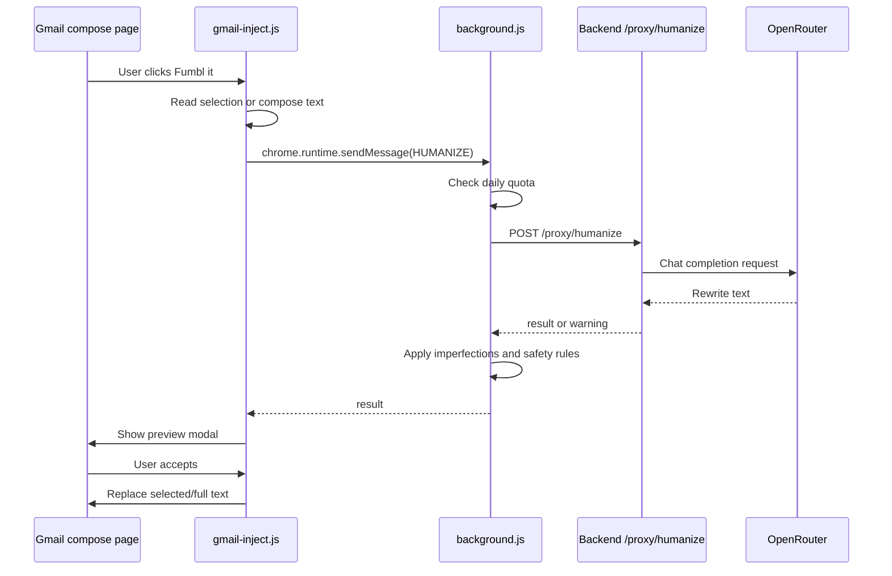

# Extension Architecture

This document explains the Chrome extension side of Fumbl: the manifest, service worker, content script, popup, local storage, and Gmail rewrite flow.

## Chrome manifest

`manifest.json` defines a Manifest V3 extension.

Important sections:

```json
{
  "manifest_version": 3,
  "permissions": ["storage", "activeTab", "scripting", "contextMenus"],
  "host_permissions": [
    "https://mail.google.com/*",
    "http://localhost:3000/*",
    "https://*.openrouter.ai/*",
    "https://fumbl.com/*"
  ],
  "background": {
    "service_worker": "background.js",
    "type": "module"
  },
  "content_scripts": [
    {
      "matches": ["https://mail.google.com/*"],
      "js": ["content/gmail-inject.js", "content/preview-modal.js"],
      "css": ["content/toolbar.css"],
      "run_at": "document_idle"
    }
  ],
  "action": {
    "default_popup": "popup/popup.html"
  }
}
```

Notes:

- `storage` is used for preferences, quota counters, and undo snapshots.
- `contextMenus` powers the right-click humanize selection feature.
- `mail.google.com` is required for Gmail injection.
- `http://localhost:3000` is required for local backend development.
- For production, replace localhost host permission with the deployed backend URL.

## Main runtime files

### `background.js`

The MV3 service worker.

Responsibilities:

- Receives `HUMANIZE` messages from content scripts.
- Checks local daily quota.
- Calls the backend endpoint `POST /proxy/humanize`.
- Applies post-processing imperfections.
- Enforces CEO lowercase safety.
- Increments quota for free users.
- Registers the context menu item.

Important constant:

```js
const BACKEND_BASE_URL = 'http://localhost:3000';
```

Change this when deploying.

### `content/gmail-inject.js`

Runs inside Gmail.

Responsibilities:

- Watches Gmail DOM for compose windows.
- Injects the Fumbl toolbar into compose footer.
- Reads selected text or full compose body.
- Sends rewrite request to `background.js`.
- Shows toasts and warnings.
- Shows rewrite preview modal.
- Applies accepted rewrites to Gmail compose.
- Stores local undo snapshots.
- Supports context-menu selected text rewrite.

Key selectors:

```js
const COMPOSE_BODY_SELECTOR = '.aDh';
const COMPOSE_FOOTER_SELECTOR = '.btC';
const EDITABLE_SELECTOR = '[contenteditable="true"]';
```

Gmail can change class names. If injection breaks, these selectors are the first place to check.

### `content/toolbar.css`

Styles:

- Gmail toolbar
- Mode buttons
- Run button
- Usage counter
- Undo button
- Toasts
- Preview modal and diff highlights

### `popup/popup.html`, `popup/popup.css`, `popup/popup.js`

The extension popup.

Responsibilities:

- Shows selected default rewrite mode.
- Shows free rewrite usage.
- Lets user choose mode.
- Lets user clear local undo snapshots.
- Links to upgrade flow.

The popup no longer asks for an Anthropic key. API access is handled only by the backend through OpenRouter.

## Message flow



## Chrome storage keys

### `chrome.storage.local`

| Key | Type | Purpose |
| --- | --- | --- |
| `preferredMode` | string | Selected default mode: `subtle`, `human`, or `ceo`. |
| `dailyCount` | number | Number of free rewrites used today. |
| `lastResetDate` | string | UTC date for quota rollover. |
| `isPro` | boolean | Pro status flag. |
| `last_original` | object | Latest undo snapshot. |
| `undo_<timestamp>` | object | Historical undo snapshots. |
| `history` | array | Legacy/history count support. |

### `chrome.storage.sync`

| Key | Type | Purpose |
| --- | --- | --- |
| `voiceProfile` | object/null | Optional voice profile used in prompts. |

## Rewrite modes

### Subtle

- Keeps professional tone.
- Adds contractions.
- Removes generic AI openers.
- Requests exactly one small first-sentence typo from the model.
- `imperfections.js` does not add another typo in subtle mode.

### Human

- Applies subtle rules.
- Shortens long sentences.
- Replaces formal phrases with casual words.
- Adds one middle-of-email imperfection.
- Casualizes sign-off.

### CEO

- Lowercase.
- Short and direct.
- Max 4 sentences.
- No sign-off/signature.
- Appends `Sent from my iPhone` in prompt, then service worker lowercases final output.

## Undo behavior

Before sending a rewrite request, the content script stores the compose body in local storage:

```js
last_original: { text: originalSnapshot, timestamp }
undo_<timestamp>: { text: originalSnapshot, timestamp }
```

The Undo button restores `last_original` into the active compose body.

## Context menu behavior

`background.js` creates a right-click menu item:

```text
Fumbl — Humanize selection
```

When clicked:

1. Chrome sends selected text to the active Gmail tab.
2. `gmail-inject.js` sends a `HUMANIZE` message.
3. The result replaces the current selection if possible.

## Development tips

### Reload after changes

After editing extension files:

1. Go to `chrome://extensions`.
2. Click reload on Fumbl.
3. Reload Gmail.

### Debug content script

Open Gmail, then open DevTools on the Gmail page. Content script logs and errors appear there.

### Debug service worker

Go to `chrome://extensions`, find Fumbl, then click the service worker inspect link.

### Debug popup

Right-click inside the popup and click Inspect.

## Common extension changes

### Change backend URL

Edit `background.js`:

```js
const BACKEND_BASE_URL = 'https://your-backend.example.com';
```

Then edit `manifest.json` host permissions:

```json
"host_permissions": [
  "https://mail.google.com/*",
  "https://your-backend.example.com/*"
]
```

### Change free daily limit

Edit `background.js`:

```js
const FREE_DAILY_LIMIT = 2;
```

Also update the display constant in `popup/popup.js` if needed:

```js
const FREE_DAILY_LIMIT = 2;
```

### Change Gmail injection location

Edit selectors in `content/gmail-inject.js`:

```js
const COMPOSE_BODY_SELECTOR = '.aDh';
const COMPOSE_FOOTER_SELECTOR = '.btC';
```

## Known limitations

- Gmail DOM selectors may break if Gmail updates its internal class names.
- Pro status is local/dev-oriented until persistent user storage is implemented.
- Backend URL is currently hard-coded in `background.js`.
- `preview-modal.js` is currently empty because preview logic lives in `gmail-inject.js`.
